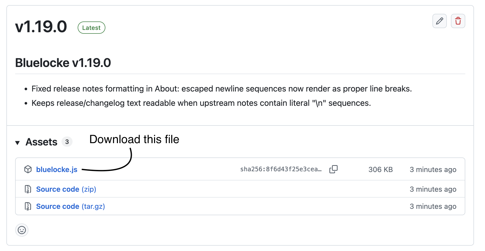

# Installation

Bluelocke runs inside the Scriptable iOS app.

## 3-Step Flow

  <a class="install-flow-btn" href="https://apps.apple.com/us/app/scriptable/id1405459188?uo=4" target="_blank" rel="noopener noreferrer">
    ↗
    
      <svg viewBox="0 0 24 24"><rect x="7" y="2.5" width="10" height="19" rx="2.3"></rect><line x1="10.5" y1="5.5" x2="13.5" y2="5.5"></line><circle cx="12" cy="18.5" r="0.9"></circle></svg>
    
    Step 1
    Install Scriptable
    Download Scriptable from the App Store.
  </a>

  <a class="install-flow-btn" href="https://github.com/devindxdev/bluelocke/releases/latest/download/bluelocke.js" target="_blank" rel="noopener noreferrer">
    ↗
    
      <svg viewBox="0 0 24 24"><path d="M12 3v10"></path><polyline points="8.5 10.5 12 14 15.5 10.5"></polyline><path d="M5 17.5h14"></path></svg>
    
    Step 2
    Direct Download
    Download the latest <code>bluelocke.js</code>.
  </a>

  

    
      <svg viewBox="0 0 24 24"><path d="M3 8.5h6l2 2h10v8.5a2 2 0 0 1-2 2H5a2 2 0 0 1-2-2z"></path><path d="M3 8.5V6.5a2 2 0 0 1 2-2h4.3l1.7 2H19a2 2 0 0 1 2 2"></path></svg>
    
    Step 3
    Move The File Into Scriptable
    On your iPhone, open the Files app and move <code>bluelocke.js</code> into the Scriptable folder in iCloud Drive.
    <code class="install-path">Files → iCloud Drive → Scriptable</code>
  

## Open Bluelocke

Open Scriptable and tap `bluelocke` to run setup.

## Optional Next

- [Widgets](./widgets)
- [Shortcuts](./shortcuts)
- [Automations](./automations)
