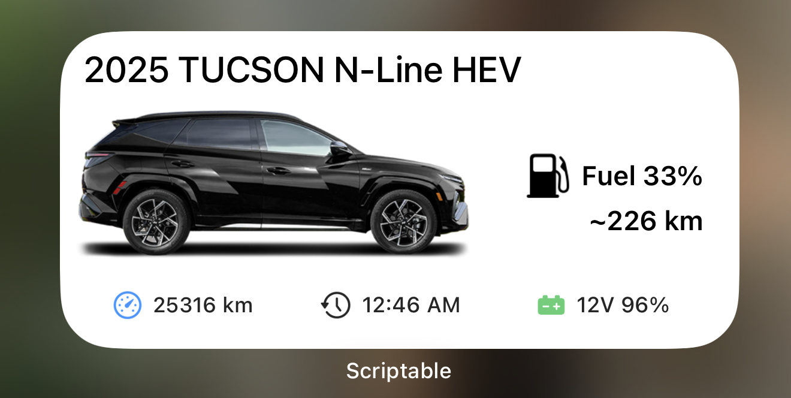
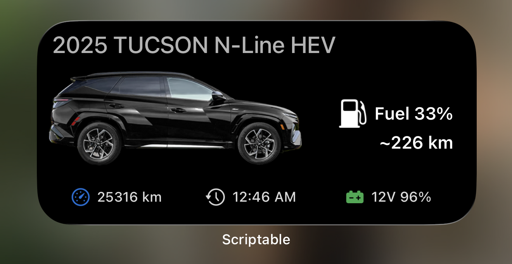

# Widgets

Bluelocke supports both Home Screen and Lock Screen widgets, so you can check your vehicle at a glance without opening the full app.

## Widget Appearance (White and Dark)

You can pick how widgets look in app settings:

- `White`
- `Dark`
- `System` (follows iPhone appearance)

The screenshots below show the white and dark widget styles:

### White Mode

### Dark Mode

## Home Screen Widgets

Bluelocke currently supports:

- `Medium` widget

### Medium Widget

The medium widget gives a fuller snapshot:

- Vehicle name at the top
- Vehicle image in the center
- Main energy/range area:
  - EV/PHEV: battery level + range
  - ICE/HEV: fuel level + range
- Bottom summary row:
  - Odometer (mileage)
  - Last updated time
  - 12V battery level

For ICE/HEV vehicles, the medium widget now shows:

- `Fuel x%` in larger text
- `~ range` in larger text below it

## Lock Screen Widgets

Bluelocke supports Lock Screen styles for faster glance info:

- `Inline`: single-line summary
- `Circular`: circular progress view
- `Rectangular`: compact detail view

These are ideal when you only need a quick status check.

## What the Widget Info Means

Here is what each value represents in plain language:

- `Fuel % / Battery %`: How much drive energy is currently available.
- `Range`: Estimated distance left based on the latest vehicle data.
- `Odometer`: Total distance on the vehicle.
- `Last Updated`: Time of the most recent successful status refresh shown in the widget.
- `12V`: Health/charge level of the auxiliary 12V battery.
- `Charging Info` (EV/PHEV): Charging state and estimated completion time.

## Refresh Behavior

Widgets are designed to stay responsive while keeping battery usage reasonable:

- Uses cached data for quick loading
- Refreshes automatically based on configured intervals
- Can trigger deeper remote refreshes if enabled

You can adjust refresh timing in app settings under `Advanced Widget Settings`.
